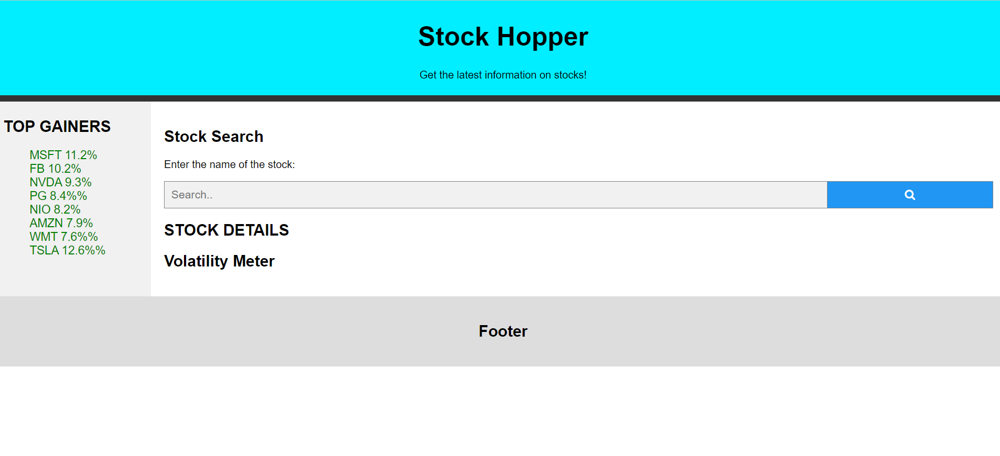

# Stock Hopper

Stock Hopper is a basic stock tracker that was built with the intention of tracking S&P 500 stocks and visualizing their stock values over the span of a year.

##Features
* Search bar for searching up a stock ticker
* Stock details menu for checking the latest trend of a stock
* Side bar that displays the latest Top Gainers

## Implementation
The frontend was made in HTML and Javascript, and the backend was coded in Python and Flask. Unfortunately, due to the time constraint, we were unable to connect the Flask backend to the frontend as we had wished due to scaling issues with Flask. If given enough time, we would have separated the Flask backend to a separate repository to deploy it remotely using Heroku. 

##Link
https://hopperhacks.herokuapp.com/